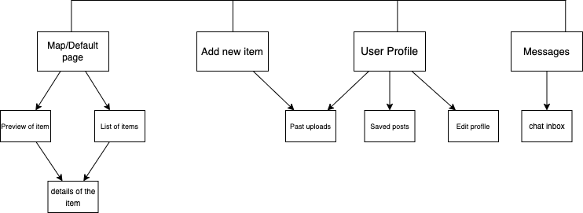

# User Experience Design

## App Map

The App doesn't have a home page. It shows the map when you open the app.

There are 4 main branches in the app:
- Map: Users can view the locations of the items uploaded by other users.
- Add New Item: Users can upload post about the items they would like to give away.
- User Profile: Users can edit their profiles and view the posts they uploaded or saved.
- Messages: Users can send and receive text messages with other users.

## Wireframes and Prototype
#

This repository contains instructions and files for two assignments that together comprise the user experience design phase of a web app.

Replace the contents of this file with the completed assignments, as described in:

- [app map & wireframe instructions](instructions-0a-app-map-wireframes.md).
- [prototype instructions](instructions-0b-prototyping.md)
