# User Experience Design

## 1. App Map

The web app doesn't have a home page. It shows the map when you open it.

There are 4 main branches in the web app:
- Map: Users can view the locations of the items uploaded by other users.
- Add New Item: Users can upload post about the items they would like to give away.
- User Profile: Users can edit their profiles and view the posts they uploaded or saved.
- Messages: Users can send and receive text messages with other users.

## 2. Wireframes
### Overview
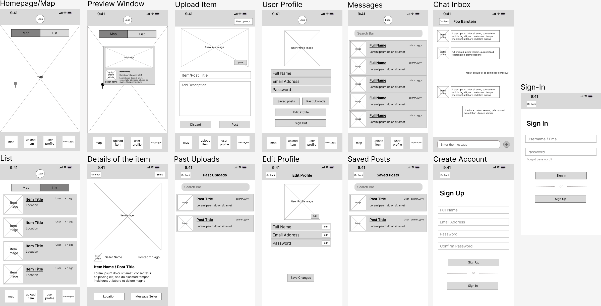

### 1. Homepage/Map

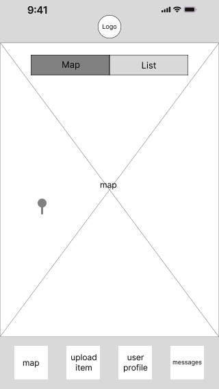
- It is the default/main page of the web app.
- It is a map with each of the pins indicates the location of the item uploaded by other users.
- The nav bar below shows 4 main branches of the web app (map / upload items / user profile / messages).

### 2. Preview window
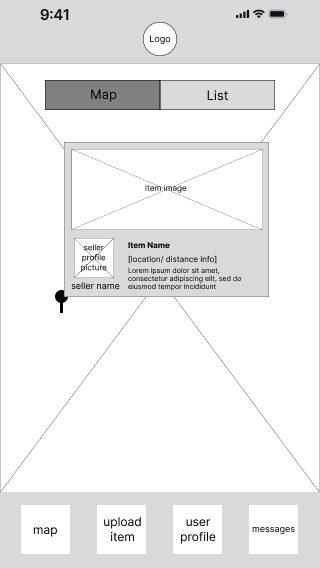
- When the user clicks a certain pin, a preview window appears.

### 3. Item List
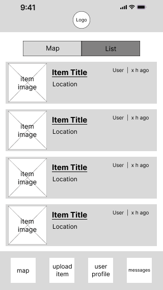
- Users can view the items in the list format rather than pins on the map

### 4. Details of the item

- It shows the detailed information of the item, including the images, the uploader and the description, etc.

### 5. Upload items
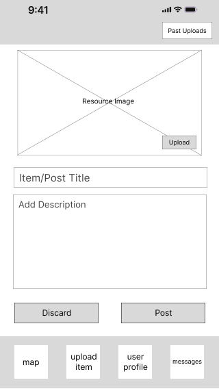
- Users can upload the items that they would like to give away

### 6. User profile
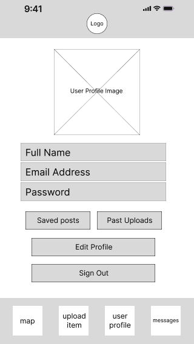
- Users can edit their profile
- Users can view the posts they uploaded
- Users can view the posts they saved

### 7. Past uploads
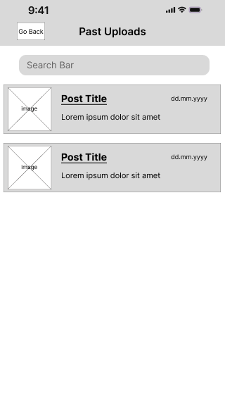
- A list of the user's past uploads

### 8. Saved posts
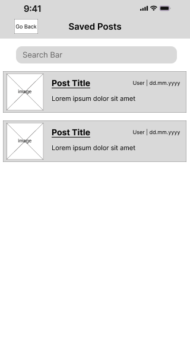
- A list the posts saved by the user.

### 9. Edit profile
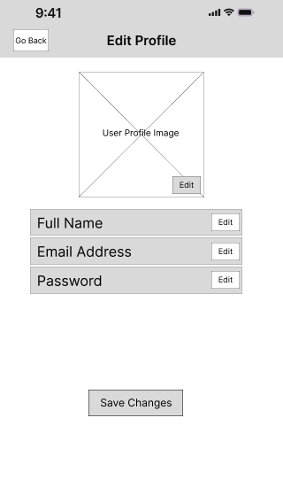
- Users can edit their profiles

### 10. Messages
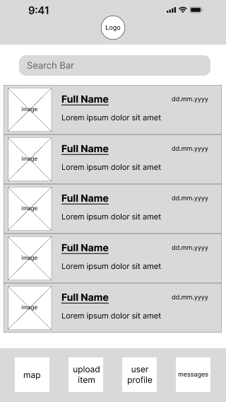
- Users can view the list of chats with other users.

### 11. Chat inbox
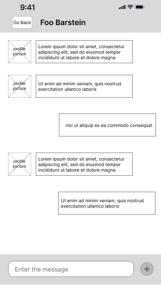

### 12. Create account
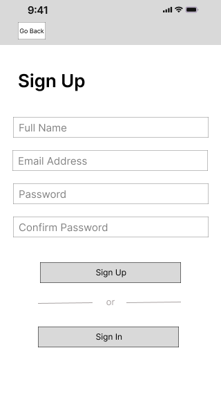
### 13. Sign in
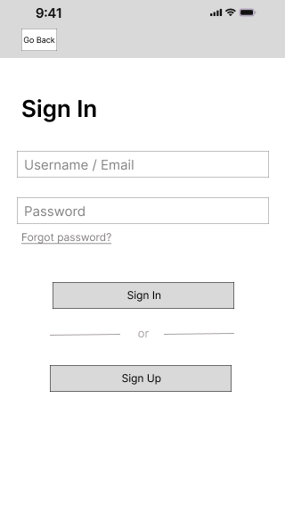

# 3. Prototype
There are two versions of the prototype
- To check the images with no repetition, please check [prototype1.fig](ux-design/prototype/prototype1.fig)
- To check the prototypes with seamless workflow, please check [prototype2.fig](ux-design/prototype/prototype2.fig)
